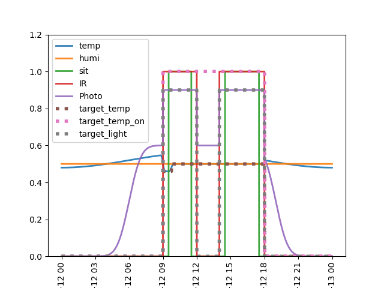

# Smart-Workspace
MECH5950 Group 3 

## Arduino
This project is using [PlatformIO IDE](https://platformio.org/) for an easier code management.
To use the code, install VScode editor and install the PlatfromIO IDE plug-in from VScode Extension tag . 
After that, create a new Arduino UNO R3 project and copy the lib and src folder to the project floder.
> [!TIP]
> If you want to use Arduino IDE, just copy all the lines in every **_.cpp_** files in **_lib_** and **_src_** folder to a new Arduino IDE project.
## User interface
The user interface are coded using python. For easy environment management, installing [conda](https://docs.conda.io/projects/conda/en/latest/user-guide/install/index.html) or [miniconda](https://docs.anaconda.com/miniconda/install/) is suggested.
After install conda or miniconda, run following to install necessary **_Python_** library using conda.
```
conda env create -f ./User_interface/environment.yml
```
To start the user interface, run following.
```
conda activative MECH5950
python main.py
```

## AI module
To run the AI module, pytorch and scipy are required. Run following to install the library using conda.
### Scipy:
```
conda install anaconda::scipy
```
### Pytorch:
```
# -- cpu version --
conda install pytorch torchvision torchaudio cpuonly -c pytorch
```
Or
```
# -- gpu version --
conda install pytorch torchvision torchaudio pytorch-cuda=11.8 -c pytorch -c nvidia
```
> [!IMPORTANT]
> **You may need to change the pytorch-cuda version depend on your machine's cuda version**

### Training 
To train the AI module, run
```
python AI_module.py --mode train
```
The conde will generate a artificial training daya like following and train the module.



### Testing 
To test the AI module, run
```
python AI_module.py --mode test
```

